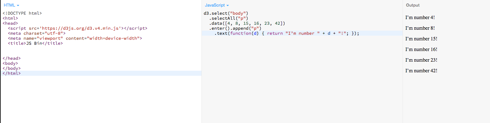

## Entry 2:
### Progress throught week:
So through the week I searched more on D3.js, so I have been experimenting and using JSBIN as my helper to tinker with D3.js.

  

^oh yea just click on the photo or go to it's file since its a long photo.
  

I learned how to use D3.js, it's very similar to CSS but you use it in javascript, it has a lot different 
attributes of html, css, and SVG,which stands for Scalable Vector Graphics which is technically an XML based 
markup language. Over the weekend I tinkered with SVG since i wasn't used to it and tinkered more with D3.js.

### Plan for this week
I have learned about all the the projects you can make with D3.js, my goal is to have an idea of what to make by tuesday night.

### Takeaways:
So whenever you start researching a new language, evereryday keep tinkering with it
just have your mind active with the language, always try something new with it just to have different ideas of what kind of things you can create
with it before you choose your final idea of what to make with it.

