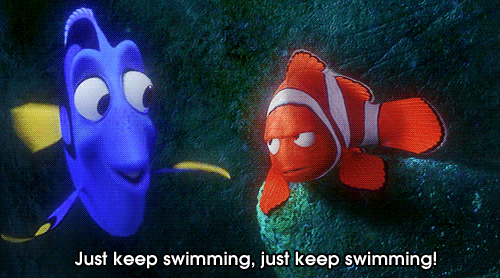
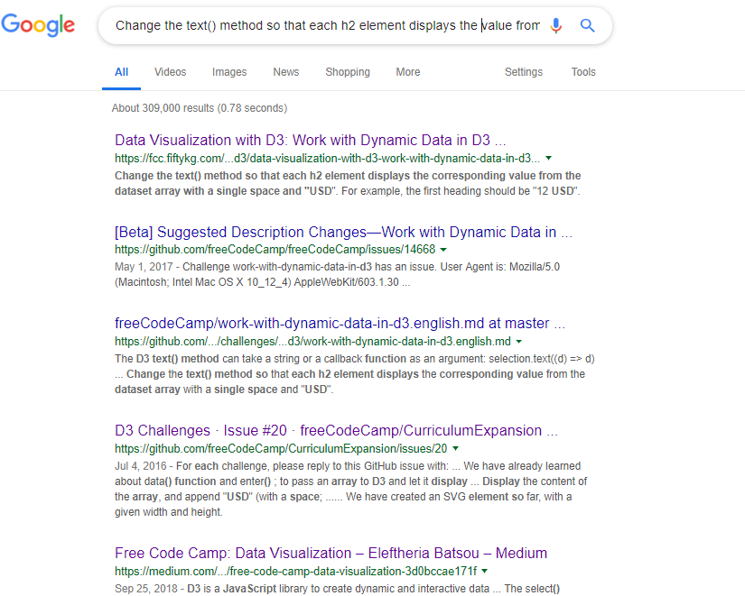

## Entry 3:

### Progress throught week:

So throughout the week I have been tinkering more and more and did more lessons on free code camp.
Here's a look at the code that I have been writing:
```//    var fruits = ['apple', 'mango', 'banana', 'orange'];
//     d3.select('ul')
//         .selectAll('li')
//         .data(fruits)
//         .enter()
//         .append('li')
    
//         .text(function(d) { return d; });
// d3.select('ul').style('color', 'darkblue');
//     d3.select('ul').style('font-size', '24px');
// d3.select("body").transition()
//     .style("background-color", "black");

// d3.selectAll("circle").transition()
//     .duration(750)
//     .delay(function(d, i) { return i * 10; })
//     .attr("r", function(d) { return Math.sqrt(d * scale); });
// var matrix = [
//   [11975,  5871, 8916, 2868],
//   [ 1951, 10048, 2060, 6171],
//   [ 8010, 16145, 8090, 8045],
//   [ 1013,   990,  940, 6907]
// ];
// const dataset = [12, 31, 22, 17, 25, 18, 29, 14, 9];
    
//     d3.select("body").selectAll("h2")
//       .data(dataset)
//       .enter()
//       .append("h2")
//       // Add your code below this line
//       .text(dataset);
// var d = d3.select("body").append("h2").selectAll("d")
//     .data(dataset)
//   .enter().append("d");

// var td = d.selectAll("td")
//     .data(function(d) { return d; })
//   .enter().append("td")
//     .text(function(d) { return d; });

  const dataset = [12, 31, 22, 17, 25, 18, 29, 14, 9];
    
    const w = 500;
    const h = 100;
    
    const svg = d3.select("body")
                  .append("svg")
                  .attr("width", w)
                  .attr("height", h);
    
    svg.selectAll("rect")
       .data(dataset)
       .enter()
       .append("rect")
       .attr("x", (d, i) => i * 30)
       .attr("y", (d, i) => h - 3 * d)
       .attr("width", 25)
       .attr("height", (d, i) => 3 * d)
//        .attr("fill", "navy");
.attr("fill", function(d) {
    return "rgb(0,"+ (d * 10) + ", " + (d * -4) + ")";
}); 
    
    svg.selectAll("text")
       .data(dataset)
       .enter()
  
//        .append("text")
//        .attr('x', (d, i ) => i * 30)
//        .attr('y', (d, i) => (h — 3* d) - 3)
//        .text((d) => d) 
```
here's a snippet

<p align = "center">
  
</p>

Here's also my code camp code :

<p align = "center">
  
</p>

So yes I have been tinkering with it a lot this week and learned more of it.
I was using google as my friend when needed help. And got a better understanding of SVG. And I looked at various different data graphs.

### Plan for this week

So last week I said I would have an idea of what I would make, so yes I have an idea of what I would make with d3.js a data graph, but this week I'm going to keep tinkering and think of what kind of data graph I will make.
 My goal for this week is to have a final idea of what kind of data graph I should make and it's gonna be final by Monday night.

### Takeaways:

<p align = "center">
  
</p>

Just keep tinkering, just keep tinkering!

Keep tinkering and have your idea of what to make ready, so while you tinker more, you add on to your project.
Keep searching things up, if you need help google is your best friend.
 <p align = "center">
  
</p>

#### sources:

https://d3-wiki.readthedocs.io/zh_CN/master/
https://d3-wiki.readthedocs.io/zh_CN/master/Selections/