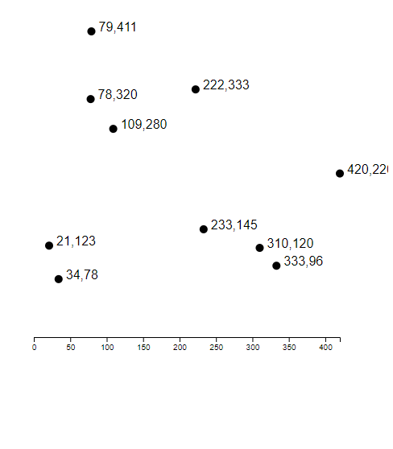
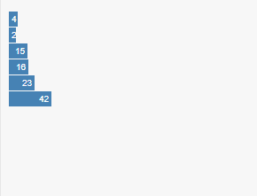
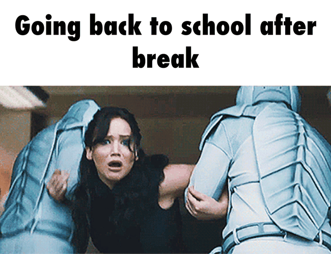

## Entry 4:

### Progress throught week:
So through out this week I was tinkering with d3.js and learned more on making bar graphs, linear scales, and scatter plots.
I learned the ways having it interact with mouse. I have a more clear picture on how to use D3.js
 

  

 

  

### Plan for this week
Start working on my final project, I have learned and tinkered a lot through these weeks of independent study. Now it is time to start creating my masterpiece. I'm gonna look into APIs, so I could create a d3 interactive graph with from an API or dataset. 

### Takeaways:
Mr. Mueller said to treat your entry-4 like a 2 week blog, so I have been tinkering and learning more during these three weeks, and now I'm gonna start doing my final project. During break we had a lot of free time, so it's good to use that time also to tinker.
 

  

