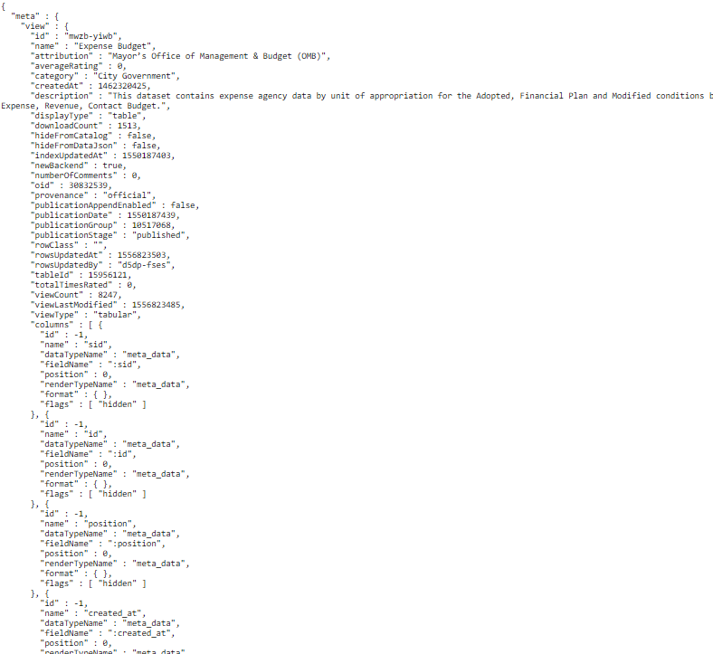

## Entry 5:

### Progress throughout week:

So thought about what I was going to do as my topic for my d3 data graph.
And a throwback i remembered was when we used json and datasets so I used NYC Open Data to check what Data I could use that I wanted and
 

  

 So I was mainly looking for datasets to use but using JSON
 
### Plan for this week:

Start using the dataset with the code and just formatting the dataset within the graph.

### Takeaways:

You could always go back to one of the lessons that we learned throughout the year and use it as a resource or a tool. Just like I remembered json and datasets so I went to the lesson all the way in November to help me look for data.

